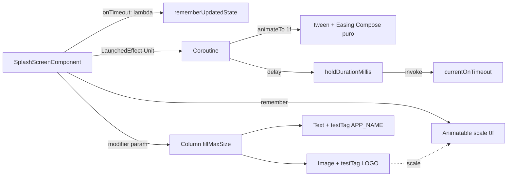

# Visão Geral

## Objetivo
Analisar a função composable `SplashScreenComponent` (arquivo `app/src/main/java/com/br/justcomposelabs/tutorial/google/compose/sideffects/rememberupdatedstate/navigation/SplashScreenComponent.kt`), identificar pontos fortes e fracos da implementação atual, e produzir um plano de melhoria passo a passo, justificando cada ponto e cada mudança proposta em sua própria seção.

## Escopo

### Dentro do escopo
- Refatoração do `SplashScreenComponent` para reduzir acoplamento ao framework Android tradicional (`android.view.animation.OvershootInterpolator`).
- Parametrização de durações da animação e do delay para facilitar testes determinísticos.
- Internacionalização do `contentDescription` da `Image`.
- Adição de `Modifier` e `testTag` para melhor testabilidade.
- Atualização (não recriação) dos testes instrumentados existentes em `SplashScreenComponentTest.kt` para usar as novas APIs parametrizadas.

### Fora do escopo
- Mudanças na navegação que consome o `SplashScreenComponent` (apenas garantir compatibilidade via parâmetros com default).
- Substituição da `Image(Icons.Filled.Home)` por outro asset/logo real.
- Implementação de novos cenários funcionais de splash (theming, branding, etc.).
- Migração para outro padrão de side-effect (manter `LaunchedEffect` + `rememberUpdatedState`).

## Nota geral atual do código: 6.5/10
O componente cumpre seu papel e demonstra corretamente o uso didático de `rememberUpdatedState`, `Animatable` e `LaunchedEffect(Unit)`. Porém, há acoplamentos, valores hard-coded e ausência de hooks de teste/i18n que reduzem qualidade de produção. Após as melhorias previstas, a estimativa é elevar para **8.5–9/10**.

# Análise: Pontos Fortes

Cada ponto abaixo está em uma seção própria com justificativa baseada no código atual (linhas referenciadas do `SplashScreenComponent.kt`).

### 1. Uso correto de `rememberUpdatedState` (linha 31)
```kotlin
val currentOnTimeout by rememberUpdatedState(onTimeout)
```
**Justificativa:** o efeito é declarado com chave `Unit` (linha 33), portanto não recompõe quando `onTimeout` muda. Sem `rememberUpdatedState`, o callback capturado seria o da primeira composição (stale lambda), bug clássico em side-effects de longa duração. A escolha aqui é livro-texto e está alinhada com o guia oficial do Compose.

### 2. Escolha apropriada de `LaunchedEffect(Unit)` (linha 33)
**Justificativa:** o efeito deve rodar exatamente uma vez por entrada na composição (animação + navegação após delay). Usar `Unit` como chave garante esse comportamento. Não há recomposições que devam reiniciar a animação. Combinado com `rememberUpdatedState`, é a abordagem canônica.

### 3. Uso de `Animatable` em vez de `animateFloatAsState` (linha 32)
```kotlin
val scale = remember { Animatable(0f) }
```
**Justificativa:** como a animação é disparada imperativamente dentro de uma coroutine e é necessário esperar seu término (`scale.animateTo(...)` é suspending) antes de chamar `delay` e `currentOnTimeout`, `Animatable` é a escolha correta. `animateFloatAsState` é declarativo e não permitiria orquestrar essa sequência.

### 4. Separação UI vs. efeito (linhas 33–52 vs. 54–65)
**Justificativa:** o `LaunchedEffect` cuida do *quando* e a `Column` cuida do *o quê*. Isso facilita leitura e segue o princípio de side-effects isolados em escopos próprios do Compose.

### 5. Default lambda no parâmetro `onTimeout = {}` (linha 30)
**Justificativa:** permite usar `@Preview` (linha 28) sem precisar passar argumentos, e mantém a API ergonômica para usos sem navegação (ex.: testes de renderização).

### 6. Componente sem estado próprio exposto (stateless contract)
**Justificativa:** o único contrato com o exterior é o callback `onTimeout`. Não há `MutableState` exposto, evitando vazamento de estado e mantendo o componente fácil de reutilizar em qualquer grafo de navegação.

# Análise: Pontos Fracos

Cada ponto abaixo tem sua própria seção, com justificativa e referência ao código atual.

### 1. Acoplamento a `android.view.animation.OvershootInterpolator` (linhas 3, 46)
```kotlin
import android.view.animation.OvershootInterpolator
...
easing = { OvershootInterpolator(2f).getInterpolation(it) }
```
**Justificativa:** mistura a stack antiga de Views com Compose. Aumenta o custo de manutenção, polui o classpath do módulo Compose com APIs de `android.view`, e dificulta migrar para Multiplatform/KMP no futuro. O Compose já oferece `Easing` nativos (`FastOutSlowInEasing`, `LinearOutSlowInEasing`) e, para o efeito "overshoot", `androidx.compose.animation.core.Spring`/`spring(dampingRatio = DampingRatioMediumBouncy)`.

### 2. Durações hard-coded (linhas 44, 50)
```kotlin
durationMillis = 1000
...
delay(2000.milliseconds)
```
**Justificativa:** impossibilita testes rápidos sem manipular o `mainClock`, e qualquer ajuste de UX ("acelerar splash em build de debug") requer recompilar. Parametrizar com defaults preserva a API atual mas habilita injeção em testes e variantes de build.

### 3. `contentDescription` hard-coded em inglês (linha 61)
```kotlin
contentDescription = "Logo"
```
**Justificativa:** quebra acessibilidade para usuários com TalkBack em pt-BR (idioma alvo do app, conforme `R.string.app_name` = "JustComposeLabs" e comentários em pt) e impede i18n. Deveria vir de `stringResource(R.string.splash_logo_content_description)`.

### 4. Ausência de parâmetro `Modifier` (linha 30)
**Justificativa:** é uma das regras de ouro de APIs composable ("Compose API guidelines"): todo composable público deve aceitar `modifier: Modifier = Modifier`. Sem isso, o chamador não consegue ajustar padding, fundo, `testTag`, semantics, etc. Atrapalha tanto reuso quanto testes.

### 5. Ausência de `testTag` nos elementos-chave (linhas 59–64)
**Justificativa:** os testes atuais dependem de strings literais (`"Logo"`, `"JustComposeLabs"`). Se i18n for aplicada, os testes quebram. `testTag` é a forma idiomática de localizar nós em testes Compose sem acoplar ao conteúdo visível.

### 6. `LaunchedEffect(Unit)` invisível para configuração de teste
**Justificativa:** o efeito sempre dispara animação+delay reais. Quando combinado com hard-code de 1000+2000ms, os testes só podem usar `mainClock.autoAdvance=false` + `advanceTimeBy`. Isso funciona, mas é frágil a mudanças de timing. Com durações injetáveis, os testes ficam mais expressivos (`durationMillis = 0` ou pequenos valores) e robustos.

### 7. Preview limitado pelo side-effect (linha 28)
```kotlin
@Preview(showBackground = true)
```
**Justificativa:** o `@Preview` dispara o `LaunchedEffect` e roda animação real no painel de preview do Studio. Sem um parâmetro para desabilitar/encurtar a animação, o preview demora a estabilizar e pode dificultar iteração visual.

### 8. Falta de KDoc no composable público (linha 29–30)
**Justificativa:** o composable expõe um contrato temporal (chama `onTimeout` após ~3s). Sem KDoc, consumidores não sabem quanto esperar nem em qual dispatcher o callback ocorrerá. Documentar contrato evita uso incorreto.

# Plano de Melhoria

Cada mudança proposta abaixo tem uma seção separada com justificativa, antes/depois e impacto.

## Princípios
- **Compatibilidade retroativa**: todos os novos parâmetros terão default. Chamadores existentes não precisam mudar.
- **Sem dependências novas**: tudo é resolvido com APIs já presentes em `androidx.compose.*`.
- **Testes verdes**: cada passo mantém os 5 testes existentes passando, ajustando apenas onde a API novo permitir simplificação.

---

## Mudança 1 — Substituir `OvershootInterpolator` por `Easing` puro do Compose

**Justificativa:** elimina o ponto fraco #1 (acoplamento). O Compose disponibiliza `androidx.compose.animation.core.Easing` como `fun interface (Float) -> Float`, então podemos implementar a fórmula de overshoot manualmente, ou alternativamente trocar `tween` por `spring(dampingRatio = Spring.DampingRatioMediumBouncy)`.

**Antes (linhas 41–49):**
```kotlin
scale.animateTo(
    targetValue = 1f,
    animationSpec = tween(
        durationMillis = 1000,
        easing = { OvershootInterpolator(2f).getInterpolation(it) }
    )
)
```

**Depois (opção A — Easing inline):**
```kotlin
private val OvershootEasing = Easing { fraction ->
    val tension = 2f
    val t = fraction - 1f
    t * t * ((tension + 1f) * t + tension) + 1f
}
...
animationSpec = tween(durationMillis = animationDurationMillis, easing = OvershootEasing)
```

**Depois (opção B — recomendada, spring nativo):**
```kotlin
animationSpec = spring(
    dampingRatio = Spring.DampingRatioMediumBouncy,
    stiffness = Spring.StiffnessLow,
)
```
O `spring` produz efeito visual equivalente ao overshoot e é a forma idiomática do Compose. Manter opção A se preservar fidelidade exata do timing for requisito.

**Impacto:** remove o import de `android.view.animation.OvershootInterpolator` (linha 3).

---

## Mudança 2 — Parametrizar durações com defaults

**Justificativa:** elimina pontos fracos #2 e #6. Habilita testes determinísticos sem manipular `mainClock`.

**Antes:**
```kotlin
fun SplashScreenComponent(onTimeout: () -> Unit = {})
```

**Depois:**
```kotlin
fun SplashScreenComponent(
    modifier: Modifier = Modifier,
    onTimeout: () -> Unit = {},
    animationDurationMillis: Int = 1_000,
    holdDurationMillis: Long = 2_000,
)
```
Dentro do corpo:
```kotlin
animationSpec = tween(durationMillis = animationDurationMillis, easing = OvershootEasing)
...
delay(holdDurationMillis.milliseconds)
```

**Impacto:** chamadores existentes continuam funcionando (defaults idênticos aos valores atuais). Testes podem passar `0` em ambos para validar comportamento sem espera.

---

## Mudança 3 — Adicionar parâmetro `modifier: Modifier = Modifier`

**Justificativa:** elimina o ponto fraco #4. Segue Compose API guidelines.

**Antes (linhas 54–58):**
```kotlin
Column(
    horizontalAlignment = Alignment.CenterHorizontally,
    verticalArrangement = Arrangement.Center,
    modifier = Modifier.fillMaxSize(),
)
```

**Depois:**
```kotlin
Column(
    horizontalAlignment = Alignment.CenterHorizontally,
    verticalArrangement = Arrangement.Center,
    modifier = modifier.fillMaxSize(),
)
```

**Impacto:** permite ao consumidor ajustar padding, background, semantics, etc., sem precisar envolver em outro container.

---

## Mudança 4 — Internacionalizar `contentDescription`

**Justificativa:** elimina o ponto fraco #3. Recurso obrigatório para acessibilidade real.

**Adicionar em `res/values/strings.xml`:**
```xml
<string name="splash_logo_content_description">Logo do JustComposeLabs</string>
```

**Antes (linha 61):**
```kotlin
contentDescription = "Logo"
```

**Depois:**
```kotlin
contentDescription = stringResource(R.string.splash_logo_content_description)
```

**Impacto:** os testes que usam `onNodeWithContentDescription("Logo")` precisarão ser atualizados para usar o novo valor (em pt-BR) **ou** preferencialmente migrar para `testTag` (Mudança 5).

---

## Mudança 5 — Adicionar `testTag` nos elementos-chave

**Justificativa:** elimina o ponto fraco #5 e torna os testes resilientes a mudanças de i18n.

**Constantes públicas no mesmo arquivo (ou em `SplashScreenTestTags`):**
```kotlin
object SplashScreenTestTags {
    const val LOGO = "splash_logo"
    const val APP_NAME = "splash_app_name"
}
```

**No composable:**
```kotlin
Image(
    imageVector = Icons.Filled.Home,
    contentDescription = stringResource(R.string.splash_logo_content_description),
    modifier = Modifier
        .scale(scale.value)
        .testTag(SplashScreenTestTags.LOGO)
)
Text(
    text = stringResource(R.string.app_name),
    modifier = Modifier.testTag(SplashScreenTestTags.APP_NAME)
)
```

**Impacto:** testes usam `onNodeWithTag(SplashScreenTestTags.LOGO)` em vez de strings literais.

---

## Mudança 6 — Adicionar KDoc no composable público

**Justificativa:** elimina o ponto fraco #8. Documenta o contrato temporal e o uso de `rememberUpdatedState`.

**Adicionar acima da declaração:**
```kotlin
/**
 * Tela de splash que exibe o logo do app com uma animação de escala (efeito "overshoot")
 * e dispara [onTimeout] após [animationDurationMillis] + [holdDurationMillis].
 *
 * Por usar `rememberUpdatedState`, é seguro passar uma lambda diferente em recomposições:
 * apenas a versão mais recente será invocada.
 *
 * @param onTimeout chamado uma única vez, na main thread, após a animação e o hold.
 * @param animationDurationMillis duração da animação de entrada da escala.
 * @param holdDurationMillis tempo de espera após a animação antes de chamar [onTimeout].
 */
```

**Impacto:** consumidores entendem o contrato sem precisar abrir a implementação.

---

## Mudança 7 — Atualizar testes existentes

**Justificativa:** garantir que os 5 cenários do `SplashScreenComponentTest.kt` continuem passando e aproveitar a nova parametrização para simplificá-los.

**Antes (cenário 3):**
```kotlin
composeTestRule.mainClock.autoAdvance = false
...
composeTestRule.mainClock.advanceTimeBy(3_500L)
```

**Depois:**
```kotlin
composeTestRule.setContent {
    JustComposeLabsTheme {
        SplashScreenComponent(
            onTimeout = { invocations.incrementAndGet() },
            animationDurationMillis = 0,
            holdDurationMillis = 0L,
        )
    }
}
composeTestRule.waitForIdle()
assertEquals(1, invocations.get())
```

E substituir `onNodeWithContentDescription("Logo")` por `onNodeWithTag(SplashScreenTestTags.LOGO)`. O cenário 4 ("não chamar antes do delay") passa a injetar `holdDurationMillis` grande (ex.: `60_000L`) e validar sem manipular o clock.

**Impacto:** testes ficam mais rápidos, legíveis e desacoplados de timings exatos.

# Arquitetura & Arquivos

## Arquivos modificados

### `app/src/main/java/com/br/justcomposelabs/tutorial/google/compose/sideffects/rememberupdatedstate/navigation/SplashScreenComponent.kt`
- Remover import `android.view.animation.OvershootInterpolator`.
- Adicionar imports: `androidx.compose.animation.core.Easing`, `androidx.compose.ui.platform.testTag`, `androidx.compose.ui.res.stringResource` (já existe).
- Adicionar parâmetros `modifier`, `animationDurationMillis`, `holdDurationMillis`.
- Substituir `easing = { OvershootInterpolator(2f).getInterpolation(it) }` por `Easing` puro (ou `spring`).
- Adicionar `testTag` em `Image` e `Text`.
- Trocar `contentDescription = "Logo"` por `stringResource(R.string.splash_logo_content_description)`.
- Adicionar KDoc.
- Adicionar `object SplashScreenTestTags` no mesmo arquivo.

### `app/src/main/res/values/strings.xml`
- Adicionar `<string name="splash_logo_content_description">Logo do JustComposeLabs</string>`.

### `app/src/androidTest/.../SplashScreenComponentTest.kt`
- Atualizar 5 cenários para usar `testTag` em vez de `onNodeWithContentDescription("Logo")`.
- Cenários 3, 4 e 5 passam a injetar `animationDurationMillis`/`holdDurationMillis` para evitar manipular `mainClock` (mais rápido e legível).
- Manter todos os 5 cenários cobertos; nenhum teste é removido.

## Diagrama de fluxo (estado atual vs. estado proposto)



## Compatibilidade
- Todos os novos parâmetros têm default igual ao comportamento atual (1000ms / 2000ms).
- Nenhum chamador externo precisa mudar.
- A única quebra possível é em testes que dependem do `contentDescription = "Logo"` literal — esses são atualizados na Mudança 7.

# Delivery Steps

###   Step 1: Desacoplar do OvershootInterpolator e migrar para Easing nativo do Compose
`SplashScreenComponent` não importa mais `android.view.animation.OvershootInterpolator` e a animação usa `Easing` puro do Compose.

- Remover o import `android.view.animation.OvershootInterpolator` em `SplashScreenComponent.kt` (linha 3).
- Adicionar um `private val OvershootEasing = Easing { fraction -> ... }` reproduzindo a fórmula `t*t*((tension+1)*t + tension) + 1` com `tension = 2f`, ou alternativamente trocar o `tween` por `spring(dampingRatio = Spring.DampingRatioMediumBouncy, stiffness = Spring.StiffnessLow)`.
- Atualizar o bloco `animateTo` para usar o novo `Easing`/`spring`.
- Atualizar o comentário didático dentro do `LaunchedEffect` para refletir a nova implementação 100% Compose.
- Garantir que o app compila e os testes instrumentados existentes continuam verdes (executando `./gradlew :app:compileDebugKotlin :app:compileDebugAndroidTestKotlin`).

###   Step 2: Parametrizar durações, adicionar Modifier e KDoc
A assinatura pública de `SplashScreenComponent` aceita `modifier`, `animationDurationMillis` e `holdDurationMillis` com defaults compatíveis, e há KDoc descrevendo o contrato temporal.

- Alterar a assinatura para `fun SplashScreenComponent(modifier: Modifier = Modifier, onTimeout: () -> Unit = {}, animationDurationMillis: Int = 1_000, holdDurationMillis: Long = 2_000)`.
- Usar `animationDurationMillis` no `tween` e `delay(holdDurationMillis.milliseconds)` em vez dos valores hard-coded.
- Propagar `modifier` para a `Column` raiz: `modifier = modifier.fillMaxSize()`.
- Adicionar KDoc acima da declaração explicando: papel da splash, contrato temporal (animação + hold), por que `rememberUpdatedState` é usado, e thread em que `onTimeout` é invocado.
- Garantir que o `@Preview` continua funcionando sem mudanças (os defaults preservam o comportamento atual).

###   Step 3: Internacionalizar contentDescription e adicionar testTag
O logo e o texto do nome do app são localizáveis e expõem `testTag` estáveis para testes.

- Adicionar `<string name="splash_logo_content_description">Logo do JustComposeLabs</string>` em `app/src/main/res/values/strings.xml`.
- Em `SplashScreenComponent.kt`, trocar `contentDescription = "Logo"` por `stringResource(R.string.splash_logo_content_description)`.
- Criar `object SplashScreenTestTags { const val LOGO = "splash_logo"; const val APP_NAME = "splash_app_name" }` no mesmo arquivo.
- Aplicar `Modifier.testTag(SplashScreenTestTags.LOGO)` na `Image` (compondo com o `scale` existente) e `Modifier.testTag(SplashScreenTestTags.APP_NAME)` no `Text`.
- Importar `androidx.compose.ui.platform.testTag`.
- Verificar compilação com `./gradlew :app:compileDebugKotlin`.

###   Step 4: Atualizar testes instrumentados para usar a nova API
Os 5 cenários de `SplashScreenComponentTest.kt` continuam passando, agora mais rápidos, sem `mainClock.advanceTimeBy` para o caso feliz e localizando nós por `testTag`.

- Em `splashScreen_displaysLogo` substituir `onNodeWithContentDescription("Logo")` por `onNodeWithTag(SplashScreenTestTags.LOGO)`.
- Em `splashScreen_displaysAppNameText` substituir o `onNodeWithText` por `onNodeWithTag(SplashScreenTestTags.APP_NAME)` (mantendo o `assertIsDisplayed`).
- Em `splashScreen_invokesOnTimeoutAfterAnimationAndDelay` passar `animationDurationMillis = 0` e `holdDurationMillis = 0L` e validar a invocação apenas com `waitForIdle()` (remover manipulação manual do `mainClock`).
- Em `splashScreen_doesNotInvokeOnTimeoutBeforeDelayCompletes` passar `animationDurationMillis = 0` e `holdDurationMillis = 60_000L`; manter `mainClock.autoAdvance = false` e validar `invocations == 0` após `advanceTimeBy(500L)`.
- Em `splashScreen_usesLatestOnTimeoutWhenLambdaChanges` injetar `animationDurationMillis = 0` e `holdDurationMillis` pequeno (ex.: `50L`) para acelerar o cenário, mantendo a troca de lambda via `LaunchedEffect(Unit) { useFirst = false }`.
- Importar `androidx.compose.ui.test.onNodeWithTag` e remover imports não usados.
- Rodar `./gradlew :app:compileDebugAndroidTestKotlin` e, se possível, a suíte instrumentada para confirmar verde.
